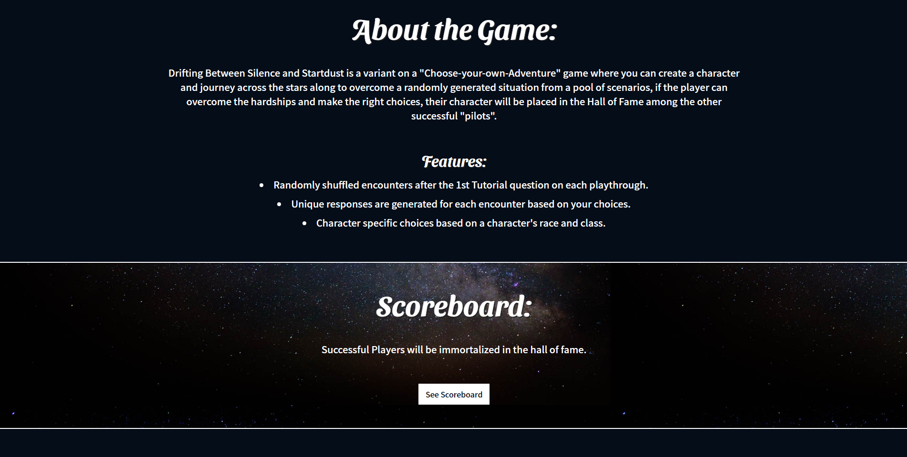

# Drifting between Silence and Stardust version 1.0
Drifting Between Silence and Startdust is a "Choose-your-own-Adventure" game that features character creation, randomly shuffled encounters and character specific choices for each encounter based on a selected character's traits. Winners of the game are given the option to add their initals to the scoreboard, which can by filtered by Recent or Top scores.

This client was built using ReactJS to create a simple text game engine that features:
- Character by Character Question/Response Rendering.
- Randomly Shuffled Questions sets for each playthrough.
- Character specific choices for each question.
- Game specific responses based on an alignment chart that correlates to a choice's aligment. 

# [Play now!](https://dbss-client.vercel.app/)
This front-end client was built with using **ReactJS**, **HTML**, and **CSS**.

## Screenshots
### Landing Page
Renders from a landing page route that pulls in its elements from src/components. 

### Tutorial Page
Renders from a tutorial page route, generates its components on that route, and pulls its tutorial gifs from src/images.

### Score Board
Renders from a scoreboard page route and renders its components on the page from a scoreboard table by pulling data filtered from the server. 

### Character Select
Renders from a char-select route however it renders the components differently if you were a logged in user or playing as a guest.

As a logged in user, it will pull the data from the character saves table linked with your user account.

As a guest, you will see blank character save slots render from the components.

### Character Create/Edit
Renders a create or edit route base on if you're editing a character or making a new one.
You're allowed to edit your character regardless if a logged in user or guest.

### Play Screen
Renders a question display route that renders components using data pulled from the question table in the server database.
The choice and response data are also pulled from the server database.

Once they are pulled the question order is randomly shuffled for each playthrough.
The choices are then filtered to match character data and after selecting a choice the following responses are rendered specifically to an alignment category that matches its alignment category for a choice.
The score in context is also updated with the score value from each choice.

QuestionDisplay:

ResponseDisplay:

### Lose Screen
### Win Screen

## Set up (for local use)
Curious about setting up the game for you own personal use?
1. clone this client to a directory
1. run `npm install` to ensure all dependencies are installed.
1. download and run the dbss server and follow it's instructions
1. create a .env file with two variables, a token that matches the server token and a endpoint address that points to your local server address.
      1. `REACT_APP_GAME_TOKEN="any token here"`
      1. `REACT_APP_API_ENDPOINT="http://somelocalhost:1337/api"`
1. run `npm start` to launch the client.

## About Me

## Features coming soon
Your README should include:
A description of your app **check**
A link to a deployed version **check**
Screenshots and your tech stack
It should also briefly describe:
      -  Where each of the components of the project live in your codebase, and
      -  If your app is meant to be re-used by other developers, then it should include instructions on how to get the app up and running.
